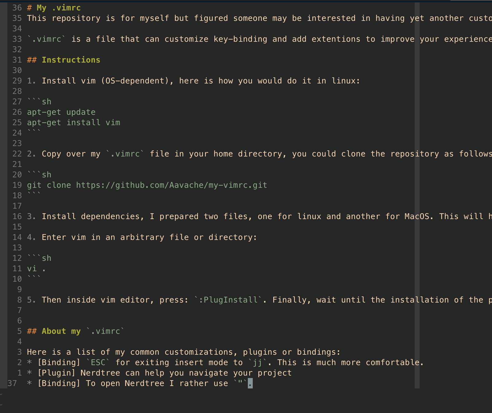

# My `.vimrc`
In this repository resides my personal `.vimrc` but I figured someone may be interested in having yet another customized `.vimrc`. 

`.vimrc` is a file that can customize key-binding and add extentions to improve your experience with vim.

## Install

1. Install vim (OS-dependent), here is how you would do it in linux:

```sh
apt-get update
apt-get install vim
```

2. Copy over my `.vimrc` file in your home directory, you could clone the repository as follows:

```sh
git clone https://github.com/Aavache/my-vimrc.git
```

3. Install dependencies, I prepared two files, one for linux and another for MacOS. This will help you installing `vim-plug` which can help you manage your vim plugins.

4. Enter vim in an arbitrary file or directory:

```sh
vi .
```

5. Then inside vim editor, press: `:PlugInstall`. Finally, wait until the installation of the plugins is completed.


## About my `.vimrc`

Here is brief list of my common customizations, plugins or bindings:
* [Binding] `ESC` for exiting insert mode to `jj`. This is much more comfortable.
* [Plugin] Nerdtree can help you navigate your project.
* [Binding] To open Nerdtree I rather use `"`.
* [Theme] gruvbox theme.
* [Other] Line number in relative to the cursor, this is helpful for jumping.




